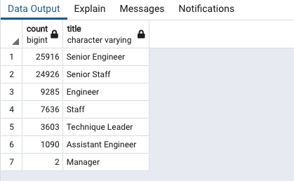
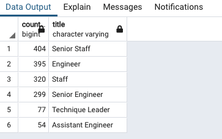
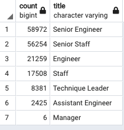

# Pewlett_Hackard_Analysis

## Overview

Pewlett Hackard is a large corporation with over 300,000 employees. The company is facing a challenge that many other businesses are facing, the “silver tsunami.” Much of Pewlett Hackard’s workforce is about to retire which will leave thousands of open positions within the company that will need to be filled. The purpose of the analysis is to determine how many vacancies per position there will be as well as determine what employees will be eligible for a mentorship program. 

## Results

-	Currently, Pewlett Hackard has 72,458 employees that are eligible for retirement. 
-	Eligible retirees make up about 24% of the company’s workforce. 
-	The chart below shows the breakdown of how many employees per title can retire. As we can see, Pewlett Hackard will lose 25,916 Senior Engineers and 24,926 Senior Staff employees. 

-	Retiring Senior Engineers and Senior Staff is 17% of the company workforce.

## Summary
Pewlett Hackard will need to prepare to fill at least 72,458 roles to fill the vacancies left by retiring employees born between 1952 and 1955. 

In the below chart we see the title count of mentorship eligible titles. There are 1,549 employees that are eligible for mentorship. There is a large disparity of mentorship eligible employees per title compared to retiring employees per title.

From a practical standpoint, Pewlett Hackard needs to look at diversifying their workforce. The provided employee data of 300,025 employees listed birth dates from 1952 to 1965. Below is a table showing what positions would need to be filled if the company had to account for retirees with birthdates through 1960. Although not everyone retires early, I think the company also needs to account for employees who retire prior to age 67. There are 164,805 employees born between 1952 and 1960 which is more than double the total of all employees. Although there are many people in the workforce who continue working after age 67, many are done working. Given the number of employees Pewlett Hackard will have to replace in the next 10 years, 1,549 of their youngest employees would not be enough to mentor hundreds of thousands of new employees needed to keep the company running as is. 

